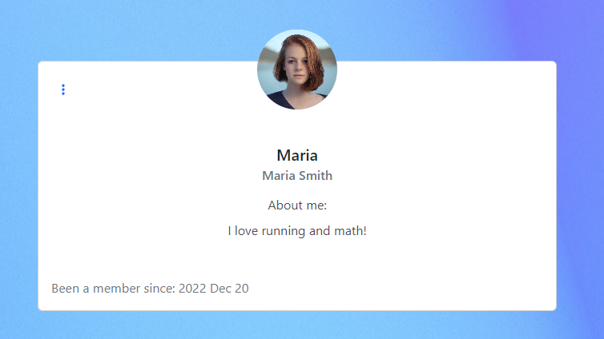

# TODO

Todo is a todo app that is aimed at companies or groups. With this app one is able to assign todo tasks to another and also leave comments on it

# Features

## Sign in and Sign up page
The user is able to create an account at the sign up page and choose a username and password
The user is able to sign in at the sign in page. The 2 has the same layout, only diffrent form fields and diffrent text.

## Todos

Here the user is able to se the todos that is either assigned to him/her or created by him/her.

- The user is able to sort todos by status, priorty 

- The user is able to order by status or priority.

- The user is also able to search for todos.

- In a todo object the following information is displayed:
  - Title
  - Status
  - Priority
  - Due date
  - Description
  - Assigned
  - If there is an attached file, this is displayed. If not, no field for it is displayed.
  - Created by.
  - Last updated.

- If a user is signed in and is a owner or assigned to the object the user is able to edit it or delete it.

- If a user is clicking on the title the user is taken to that todos specific page. 
- Here the user is able to make comments/notes.

### Todo creation and edit page.

At the creation page the user is able to create todos.

Here the user is able to create a todo with the requiered fields:
    - Title
    - Content
    - Priority
    - Status
    - Due date
    - File
    - Assigned

The edit page has the same layout and fields, only diffrent text to match an edit form. 

## Profile page

- The customer can find both phone number and email adress.

- The customer can take part of a map that show exactly where the restaurant is located.

At the profile pages a user can read more about other users and change their own profile.

# Testing

- I have tested the application on mobile and also in diffrent browsers to make sure everything is displayed correctly and that every button works as expected.

- I have also made some automated tests, it tests the navbar and profile page.

## Solved Bugs

When deploying the application to heroku there were multiple bugs that arose.

Almost all of them were made by me that was typos.

There was some bugs that arose that i had to solve, but turns out i made wrong model querys.

## Remaining Bugs

- There are no known bugs remaining.

# Validator Testing

The code is ran through ESlinter and no errors occur.

There is one warning that i have chosen to leave. Or else when trying to fix this the page got stuck in an infinte loop, and fired API requests hundreds of times.

"WARNING in [eslint]\
src/pages/todo/TodosPage.js\
  Line 63:8:  React Hook useEffect has a missing dependency: 'searchFields'. Either include it or remove the dependency array. You can also do a functional update 'setSearchFields(s => ...)' if you only need 'searchFields' in the 'setSearchFields' call  react-hooks/exhaustive-deps"¨

# Libraries used
- React bootstrap 
- Infinite scroll - This is used to automaticly fetch new todos as the user has reached/is nearing end of the page.

I was looking out for a datepicker as i had trouble figuring out how to implement the date picker from bootstrap. so i looked in to [this](https://www.npmjs.com/package/react-datepicker) library. But then it struck me, and i figured out how to implement it with bootstrap.

I realise now after the site is almost done that i could have checked for more packages at [npmjs.com](https://www.npmjs.com/)

# Deployment

To deploy the project to heroku, do the following

1. Create a app in heroku.
2. If your site is on Github, in the Heroku app go in to "Deploy" and connect your github account and project.
Lastly scroll down and click on "Deploy Branch" and make sure "main" is selected.

# Project Goals
The project goals for this project were to create a todo page for a company so that they can keep tack on what they need to do, where it was also possible to assign the task to someone else. 

# UX design work

The design were made with simpicity in mind. I designed this wireframes on [creatly](app.creately.com) to have a get a visual on my vision i had in mind.

# User stories
These are the stories i worked after when i made the application

## Navigation & Authentication
- Navigation: As a user I can view a navbar from every page so that I can navigate easily between pages
- Routing: As a user I can navigate through pages quickly so that I can view content seamlessly without page refresh
- Authentication - Sign up: As a user I can create a new account so that I can access all the features for signed up users
- Authentication - Sign in: As a user I can sign in to the app so that I can access functionality for logged in users
- Authentication - Logged in Status: As a user I can tell if I am logged in or not so that I can log in if I need to
- Authentication - Refreshing access tokens: As a user I can maintain my logged-in status until I choose to log out so that my user experience is not compromised
- Navigation: Conditional rendering - As a logged out user I can see sign in and sign up options so that I can sign in/sign up
- Avatar: As a user I can view user's avatars so that I can easily identify users of the application

## The Posts Page
- View most recent posts: As a user I can view all the most recent,
- todos ordered by most recently created first so that I am up to date with the newest content
- As a user, I can search for todos with keywords, so that I can find the Todos I want to find easily.
- View assigned todo: As a logged in user I can view todos filtered by “assigned to me” so that I can easily see the todos assigned to me
- View created todos: As a logged in user I can view todos filtered by “Created by me” so that I can easily see the todos created by me
- Filter: As a user i can filter todos by priority or status so that i can easly se the most urgent todos
- Infinite scroll: As a user I can keep scrolling through todos on the site, that are loaded for me automatically so that I don't have to click on "next page" etc
- Post page: As a user I can view the todo page so that I can read the comments about the todo
- Edit post: As a Todo owner I can edit my todo so that I can make corrections or update my Todo after it was created

## Comments
- Create a comment: As a logged in user I can add comments to a Todo so that I write work notes and/or comment to other assigned. 
- Comment date: As a user I can see how long ago a comment was made so that I know how old a comment is
- View comments: As a user I can read comments on Todos so that I can read what other users has done with the task
- Delete comments: As an owner of a comment I can delete my comment so that I can control removal of my comment from the application
- Edit a comment: As an owner of a comment I can edit my comment so that I can fix or update my existing comment

## The Profile Page
- Profile page: As a user I can view other users profiles so that I can learn more about them
- Edit profile: As a logged in user I can edit my profile so that I can change my profile picture, bio and name
- Update username and password: As a logged in user I can update my username and password so that I can change my display name and keep my profile secure

# Credits

## Special thanks
- To code institute for the inspiration and help with this project through out the project.
- [MDBbootstrap](mdbootstrap.com), altough it was a diffrent npm package for bootstrap their documentation was super easy to understand and was easy to implement to normal bootstrap package used.
- It was also from [MDBbootstrap](mdbootstrap.com) i got the sign in form base. and i modified it to my liking. 
- [usehooks.com](https://usehooks.com/useWindowSize/) for a good explanation for the windowsize hook that i used to know how i was gonna display the profile dropdown menu.

## Media
- Default profile picture from Code Institute.
- Logo was generated at logo.com
- UI pictures was from Freepik 
    - [404 image](https://www.freepik.com/free-vector/404-error-with-portals-concept-illustration_20824302.htm#query=not%20found&position=13&from_view=search&track=sph)
    - [Please sign in image](https://www.freepik.com/free-vector/mobile-login-concept-illustration_4957136.htm#query=sign%20in&position=0&from_view=search&track=sph)
    - [Sign in image](https://www.freepik.com/free-vector/access-control-system-abstract-concept_12085707.htm#query=login&position=0&from_view=keyword%22%3EImage%20by%20vectorjuice)
- the loading gif is from [loading.io](https://loading.io/)
- Profile picture for Henrik: https://unsplash.com/photos/7YVZYZeITc8
- Profile picture for Maria: https://unsplash.com/photos/rDEOVtE7vOs